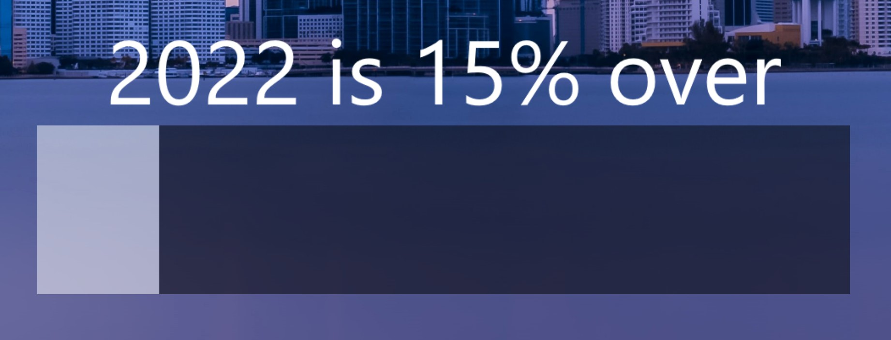

# Year Progress Bar

This is a simple Rainmeter skin that provides two skins for tracking how much of the year has passed. It includes both a progress bar and a text printout. They are separate skins, so you can elect to use either one or both.

Inspired by discussion of the year progress twitter account on the [Cortex Podcast, episode 118.](https://www.relay.fm/cortex/118)

